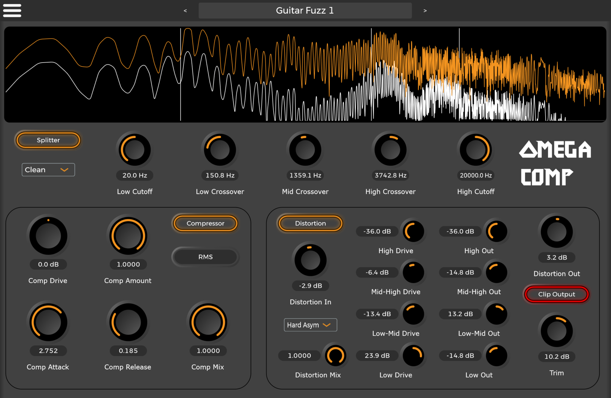
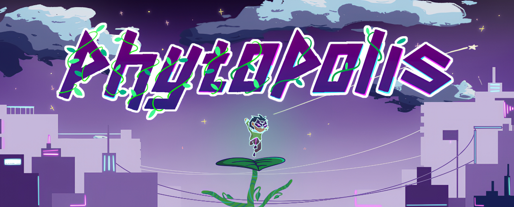
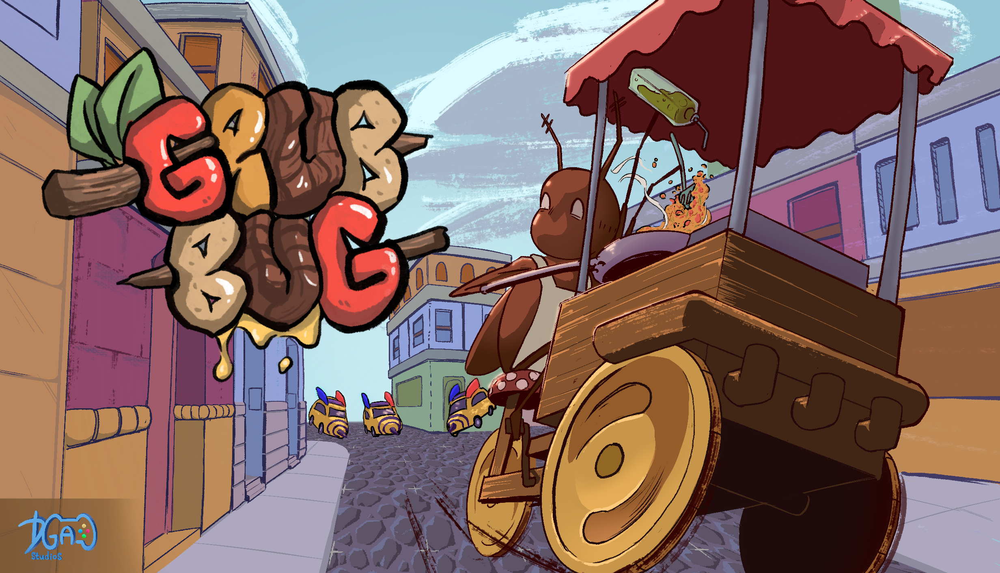

Thanks for coming to take a look at my website. Below are some projects I've worked on that showcase my problem solving abilities, adaptability, and technical skills.

## Omega Comp

This is the largest independent project I've worked on so far. I conducted market research to identify underserved needs in the audio processing software space, then designed, developed, and released a product to address them. I built the core algorithms and GUI using C++ and JUCE, and designed a purchase authentication service with Python and AWS. My direct involvement in both the business analysis and software engineering aspects allowed me to create a product that speaks to the needs of users while maintaining high technical standards.

Omega Comp is available for purchase [here](https://daybreakaudio.com/). 

I've also made some of the source code available [here](https://jordan-rudolph.github.io/404).

## Phytopolis

After being elected to the project lead role in Cornell University's Game Development course, I guided an eight-person team of programmers and artists through a comprehensive development cycle. I managed weekly sprint planning, handled GitHub repository administration, delivered on my own programming responsibilities, and presented bi-weekly project status updates. This role deepened my understanding of large-scale software development and strengthened my ability to guide technical projects from initial concept to final delivery. All code was written using Java, the LibGDX framework, and OpenGL.

You can find a download of Phytopolis [here for Windows](https://gdiac.cs.cornell.edu/gdiac/showcase/gallery/phytopolis/Phytopolis-Win.zip) and [here for Mac](https://gdiac.cs.cornell.edu/gdiac/showcase/gallery/phytopolis/Phytopolis-Mac.zip). 

I've also made some of the source code available [here](https://jordan-rudolph.github.io/404).

## DGA Studios

During my time at Cornell, I also decided to join Cornell's game development team, DGA Studios. At this position, I coordinated audio design and integration into our Unity-based game development project, Grub Bug. This included designing real-time audio processing functions in C\#, coordinating the tasks of a junior developer, and implementing spatialized audio functionality and logic across multiple objects and scripts. During this project, I also wore multiple hats, and functioned as a composer and sound designer in addition to a programmer.

You can find a download of Grub Bug [here](https://dgacornell.itch.io/grubbug).

I've also made some of the source code available [here](https://jordan-rudolph.github.io/404).

## Closing Statement

I appreciate you taking the time to read to the end of my portfolio. If you have any questions, I'm always available at [jordanmrudolph@gmail.com](mailto:jordanmrudolph@gmail.com), or by phone at (978)-987-8864. 

I'll leave you with one of my personal favorite programming quotes:

> _"Any fool can write code that a computer can understand._
> _Good programmers write code that humans can understand."_

_-Martin Fowler_